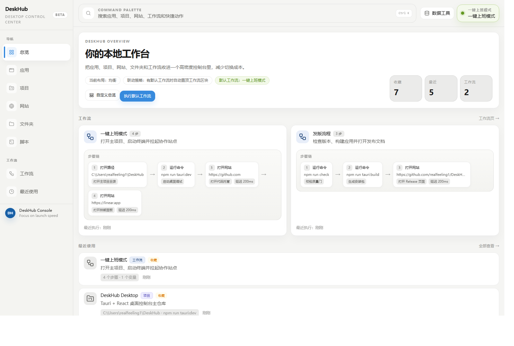
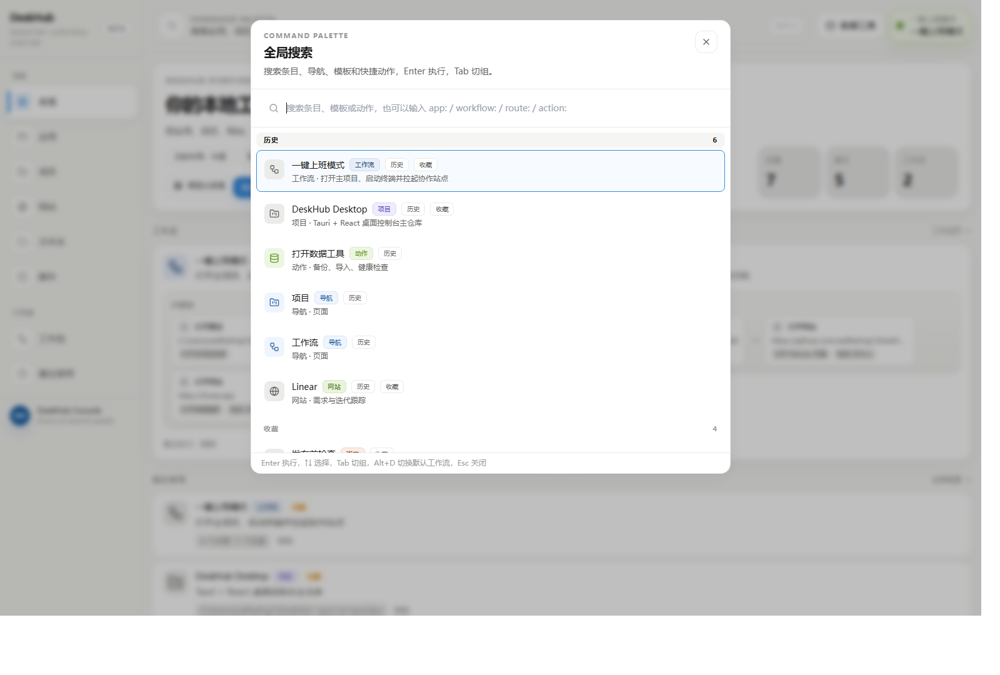
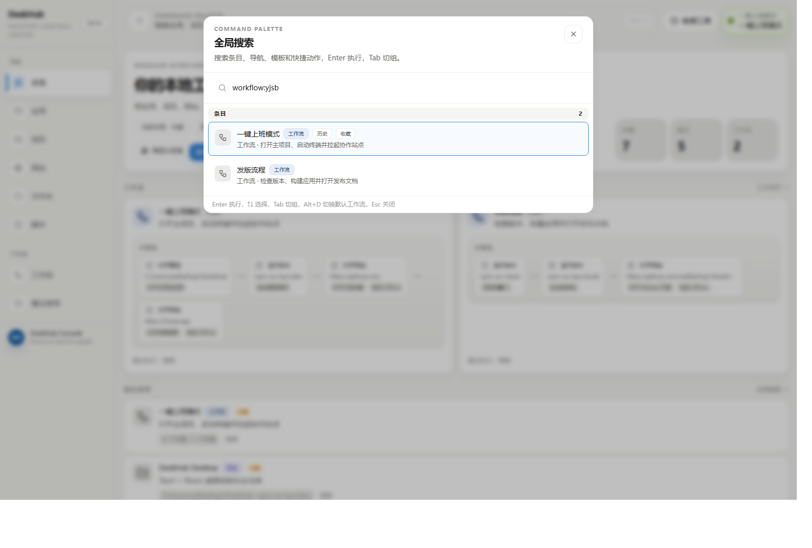
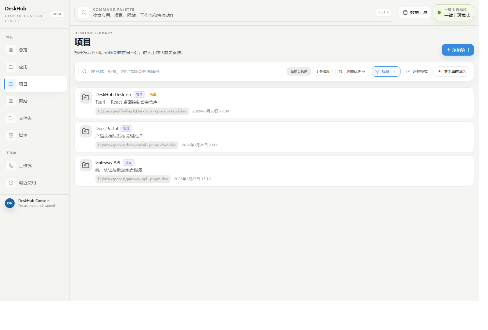
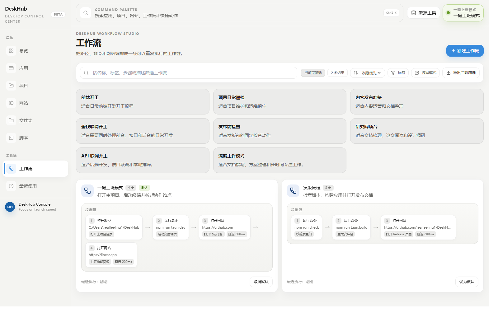

<div align="center">

# DeskHub

**Your local launch console for apps, projects, websites and workflows.**

DeskHub 是一个基于 `Tauri + React + TypeScript + Tailwind CSS + SQLite` 的桌面工作台，用来统一管理本地工具和常用网站，并支持一键启动与工作流。


[首版素材预览](./release-assets/first-release-draft/README.md) · [项目状态](./PROJECT_STATUS.md) · [关键决策](./DECISIONS.md)

</div>



它不是传统的大留白 Dashboard，而是偏高密度、键盘优先、面向开发者和高频电脑用户的“桌面控制台”。核心目标只有四个：

- 搜索快
- 启动快
- 管理快
- 数据可靠

## 界面预览

<table>
  <tr>
    <td width="50%" valign="top">
      
      <p><strong>命令面板是一号入口</strong><br />搜索应用、项目、网站、页面导航和全局动作，减少层层进入页面的成本。</p>
    </td>
    <td width="50%" valign="top">
      
      <p><strong>工作流可直接搜索执行</strong><br />工作流足够高频时，直接从命令面板启动通常比进入工作流页更快。</p>
    </td>
  </tr>
  <tr>
    <td width="50%" valign="top">
      
      <p><strong>资源页负责管理</strong><br />排序、标签筛选、收藏、多选和批量操作集中在资源页完成。</p>
    </td>
    <td width="50%" valign="top">
      
      <p><strong>工作流页负责进入状态</strong><br />步骤链直观可见，默认工作流和一键上班模式形成完整闭环。</p>
    </td>
  </tr>
</table>

## 为什么会需要它

真实工作环境里的入口通常是碎的：

- 软件在开始菜单、桌面或固定栏里
- 项目分散在不同磁盘和工作区目录里
- 常用网站躺在浏览器书签和历史里
- 启动服务要敲命令
- 固定工作流每天都要手动重复一遍

DeskHub 把这些入口收进同一套模型里，让你可以：

- 搜索一个名字，立刻打开目标
- 点一下工作流，直接进入当前工作状态
- 把最近、收藏、项目和网址都留在同一套工作台里

## 当前状态

当前主线版本处于 `V2.1`，已经完成：

- 参考图风格的信息架构与高密度控制台 UI
- SQLite 正式持久化与数据工具链
- 批量管理、命令面板、工作流增强
- `Q` 跨平台 launcher backend 预研落地
- `R` 中长期方向的第一阶段落地

## 当前能力

- 统一管理 6 类条目：应用、项目、网站、文件夹、脚本、工作流
- `Ctrl+K / Cmd+K` 全局命令面板，支持条目、页面导航、全局动作
- 中文、拼音、首字母搜索
- 收藏、最近使用、默认工作流
- workflow 顺序执行 `open_path / open_url / run_command`
- `script` 与 workflow `run_command` 支持 `blocking / new_terminal / background`
- workflow 已支持变量、条件、失败策略、重试、跳转与执行摘要
- 支持 `.cmd / .bat / .ps1 / .lnk` 等常见 Windows 入口
- 支持原生路径选择器录入应用、项目、文件夹
- 支持批量收藏、批量取消收藏、批量删除、导出所选
- 支持数据库备份/恢复、条目 JSON 导入/导出、健康检查、一致性检查、结构化报告导出
- 支持总览布局自定义、预设布局切换与持久化
- 支持 starter templates 与扩展 workflow templates
- 支持项目目录半自动扫描导入

## 核心亮点

| 能力 | 说明 |
| --- | --- |
| 命令面板优先 | `Ctrl+K / Cmd+K` 是一号入口，支持条目、导航、动作统一搜索 |
| 六类资源统一管理 | 应用、项目、网站、文件夹、脚本、工作流放在一处 |
| 工作流可视化 | 直接展示步骤链，点之前就知道会执行什么 |
| 数据层正式化 | SQLite 持久化，配套备份、恢复、导入导出、健康检查 |
| 高密度 UI | 更接近 Raycast / Linear 风格的开发者控制台，而不是 SaaS 仪表盘 |

## 信息架构

主导航固定为：

- 总览
- 应用
- 项目
- 网站
- 文件夹
- 脚本
- 工作流
- 最近使用

第一入口固定为：

- 命令面板 `Ctrl+K / Cmd+K`

## Q / R 进展

### Q. 跨平台 launcher backend

当前已经建立统一平台启动抽象，并补齐基础 backend：

- Windows：当前最完整、最优先验证的平台
- macOS：已支持 `open`、Terminal 新终端执行、后台命令执行
- Linux：已支持 opener fallback、终端探测、新终端执行、后台命令执行

详细能力矩阵见：[PLATFORM_SUPPORT.md](./PLATFORM_SUPPORT.md)

### R. 中长期方向第一阶段

当前已经先落地以下更偏产品化的能力：

- 总览页布局预设：`均衡 / 专注启动 / 流程优先 / 资源盘点`
- 总览布局顺序与隐藏状态持久化
- 项目目录半自动导入：扫描工作区、识别项目、跳过重复、批量导入
- workflow 模板库继续扩充，补入更贴近日常开发的模板

## 技术栈

- 前端：React 19 + TypeScript + Vite + Tailwind CSS
- 桌面壳：Tauri v2
- 后端：Rust
- 正式存储：SQLite
- 路由：`react-router-dom`
- 搜索增强：`pinyin-pro`
- 通知：`sonner`
- 图标：`lucide-react`

## 目录结构

```text
src/
  app/                  # 路由、应用骨架、全局状态
  components/           # Sidebar / Topbar / CommandPalette / 各类卡片与模态框
  hooks/                # useItems / useSearch / usePersistedListControls
  lib/                  # tauri API、搜索、导航、布局与工具函数
  pages/                # Overview / Resource / Workflows / Recent
  types/                # 前端共享类型

src-tauri/src/
  main.rs               # Tauri 注册入口
  commands.rs           # Tauri command 暴露层
  launcher.rs           # 统一启动编排与 workflow 执行
  platform_launcher.rs  # 平台启动抽象层
  migrations.rs         # SQLite schema migration runner
  models.rs             # Rust 数据模型
  project_inspector.rs  # 项目目录扫描与识别
  storage.rs            # SQLite、导入导出、健康检查、数据工具
```

## 数据与运行时

- 正式持久化文件：`<appDataDir>/data/deskhub.db`
- 旧 `items.json` 已废弃，不迁移、不自动删除、不参与运行时
- 默认工作流、命令历史、数据工具历史、UI 设置统一进入 SQLite
- 启动时会执行 migration 与数据库健康检查

## 本地开发

安装依赖：

```bash
npm ci
```

启动前端开发服务：

```bash
npm run dev
```

启动 Tauri 桌面开发模式：

```bash
npm run tauri:dev
```

## 常用命令

```bash
npm run lint
npm run test:run
npm run build
npm run test:rust
npm run check
npm run tauri:build
```

提交前建议至少执行：

```bash
npm run check
```

## 关键交互

### 命令面板

- `Ctrl+K / Cmd+K` 打开
- 可搜索条目、导航页和全局动作
- 可直接新建六类条目
- 可直接设置或取消默认工作流
- 支持 `app:` `project:` `website:` `folder:` `script:` `workflow:` `route:` `action:` scoped 搜索

### 一键上班模式

- Topbar 右侧始终可见
- 已设置默认工作流时可直接执行
- 未设置时会引导去工作流页配置

### 总览

- 默认包含最近使用、收藏、工作流、资源库概览
- 支持布局预设切换
- 支持区块顺序调整、隐藏与恢复默认
- 上述状态会持久化保存

### 数据工具

- 支持数据库备份/恢复
- 支持条目 JSON 导入/导出
- 支持导入预检
- 支持健康检查、一致性检查、数据库优化
- 支持项目目录扫描导入
- 支持持久化操作历史

## 平台支持

DeskHub 当前仍然是 `Windows First`，但 launcher backend 已经不再只有 Windows 一条路。

- Windows：完整度最高，当前主验证平台
- macOS：已有基础 backend
- Linux：已有基础 backend

这并不代表三个平台已经完成全链路产品化适配。更准确的现状和能力边界，请看：[PLATFORM_SUPPORT.md](./PLATFORM_SUPPORT.md)

## 当前限制

- Windows 仍是当前主目标平台
- `project.devCommand` 目前固定按“新终端运行”语义处理
- macOS / Linux 已有基础 launcher backend，但还没有做完整产品化回归与安装分发适配
- “空间 / 分组”这类会影响信息架构的大项仍未进入正式实现

## 文档地图

- [AGENTS.md](./AGENTS.md)：协作约定、边界与实现原则
- [DECISIONS.md](./DECISIONS.md)：已锁定的产品与技术决策
- [PROJECT_STATUS.md](./PROJECT_STATUS.md)：当前阶段、已完成能力、下一步方向
- [PLATFORM_SUPPORT.md](./PLATFORM_SUPPORT.md)：跨平台 launcher 能力矩阵与边界
- [CHANGELOG.md](./CHANGELOG.md)：版本变化记录
- [VERSIONING.md](./VERSIONING.md)：版本号、tag 与发布策略
- [RELEASE.md](./RELEASE.md)：发布 checklist 与回归清单
- [RELEASE_ASSET_TEMPLATES.md](./RELEASE_ASSET_TEMPLATES.md)：release 截图、更新说明、升级须知与 smoke test 模板
- [PACKAGING_STRATEGY.md](./PACKAGING_STRATEGY.md)：安装包元信息基线与 installer / zip 策略评估
- [release-assets/first-release-draft/README.md](./release-assets/first-release-draft/README.md)：首版真实 release 截图与说明素材草案
- [PERFORMANCE_BASELINE.md](./PERFORMANCE_BASELINE.md)：当前构建产物体积基线与第二阶段观察
