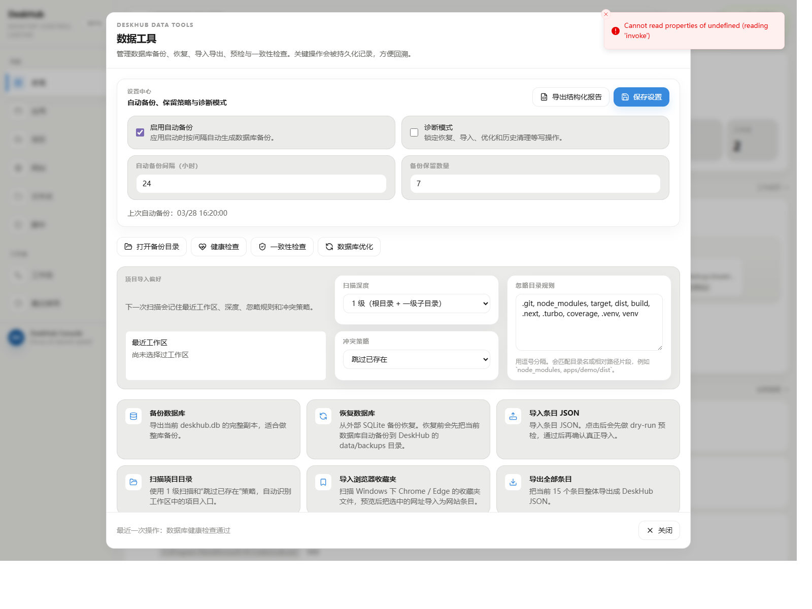

# DeskHub 首版 Release 更新说明素材

最后更新：2026-03-28

适用场景：首版公开发布候选文案草案  
版本状态：版本号待定；按当前 [`VERSIONING.md`](../../VERSIONING.md) 规则，更适合走一次 `minor` 升级

## 一句话介绍

DeskHub 是一个统一管理本地工具和常用网站，并支持一键启动与工作流的电脑工作台。

## 本版亮点

- 用一个高密度桌面控制台，把应用、项目、网站、文件夹、脚本和工作流收在一起。
- `Ctrl+K / Cmd+K` 命令面板已经成为真正的一号入口，支持中文、拼音、首字母、导航和动作搜索。
- 工作流支持把目录、网站和命令串成“一键上班模式”，并可设置默认工作流直接从顶部触发。
- SQLite、本地备份恢复、导入导出和健康检查已经形成正式的数据层，而不是临时 JSON 存储。

## 新增

- 六类条目统一管理：应用、项目、网站、文件夹、脚本、工作流。
- 工作流变量、条件、失败策略、重试、跳转和执行摘要。
- 命令面板 route / action / item 三类统一结果与命令历史。
- 路径选择器、项目目录半自动导入、浏览器收藏夹导入。
- 数据工具：数据库备份、恢复、预检、健康检查、一致性检查、优化、结构化报告导出。
- 总览布局模板、默认工作流联动和“ 一键上班模式 ”顶部入口。

## 改进

- UI 已统一成更接近开发者工作台的高密度控制台风格。
- 搜索链路已支持预热、缓存和更合理的 idle 加载边界。
- 管理页支持排序、标签筛选、选择模式与批量操作。
- Windows 启动器对 `.lnk / .cmd / .bat / .ps1` 和复杂路径的容错更稳定。

## 已知限制

- 当前仍是 `Windows First`。
- macOS / Linux 已有基础 backend、CI 编译校验与 launcher 单测，但还没有完成全链路产品化适配。
- 旧 `items.json` 不会自动迁移到 SQLite。
- portable zip 仍处于评估中，本轮默认只建议 installer 作为正式发布产物。

## 配图建议

